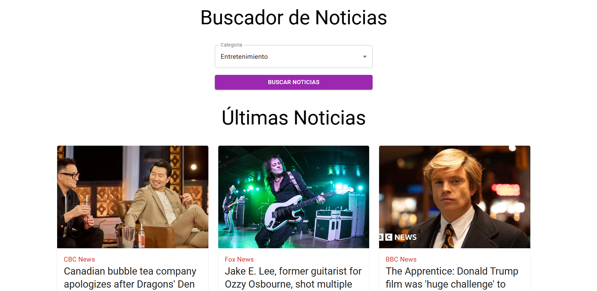

<!-- Banner -->

# 👋 ¡Hola gracias por visitar mi Proyecto!

## 🚀 Proyecto: Buscador de Noticias

Este es el frontend de Buscador de Noticias, una aplicación web que te permite buscar noticias actualizadas en tiempo real utilizando la API de NewsAPI. Con esta herramienta, los usuarios pueden consultar noticias filtradas por tema, fuente o palabras clave de manera rápida y eficiente.

## 🛠️ Tecnologías Utilizadas

- **React**: Librería para construir interfaces de usuario.
- **Axios**: Cliente HTTP para realizar peticiones a la API.
- **Emotion (react y styled)**: Librería para aplicar estilos en componentes de manera dinámica y estilizar componentes React con CSS-in-JS.
- **Material UI (MUI)**: Conjunto de componentes de interfaz de usuario para React, utilizados para crear una interfaz atractiva y accesible.

## 🎥 Prueba la Aplicación

Puedes probar la aplicación en vivo visitando [este enlace en Netlify](https://buscadornoticiasapi.netlify.app/).

## 📝 Funcionalidades Principales

- **Búsqueda de Noticias**: Los usuarios pueden buscar noticias por tema, fuente o palabras clave utilizando la API de NewsAPI.
- **Filtrado Avanzado**: Los resultados de las noticias pueden filtrarse por categoría, país y fecha.
- **Interfaz de Usuario Atractiva**: La aplicación cuenta con un diseño moderno y amigable, construido con Material UI y estilos personalizados mediante Emotion.
- **Resultados en Tiempo Real**: Las noticias se actualizan y muestran en tiempo real a medida que el usuario ingresa los parámetros de búsqueda.

## 📂 Estructura del Proyecto

bash
src/
├── components/       # Componentes reutilizables
├── context/          # Gestión de estado global, si es necesario en el futuro
└── hooks/            # Hook personalizado para usar el useContext

## 🚀 Cómo Empezar
1. Clona el repositorio:

bash
git clone https://github.com/RodrigoLoboDev/Buscador-NoticiasAPI

2. Instala las dependencias:

bash
npm install

3. Inicia el servidor de desarrollo:

bash
npm run dev

## 📸 Capturas de Pantalla

## 🤝 Contribuciones
Las contribuciones son bienvenidas. Si tienes ideas para mejorar el proyecto, no dudes en abrir un issue o hacer un pull request.

## 📧 Contacto
- Email: rolobo2812@gmail.com
- LinkedIn: [Jesús Luis Rodrigo Lobo](https://www.linkedin.com/in/jes%C3%BAs-luis-rodrigo-lobo-6594a81b4/)
- GitHub: [RodrigoLoboDev](https://github.com/RodrigoLoboDev)

#### ⭐️ Si te gusta lo que hago, no dudes en seguirme y contribuir a mis proyectos. ⭐️